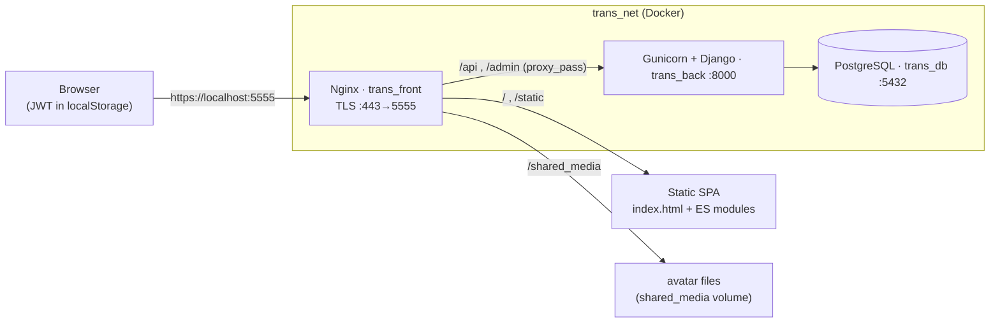
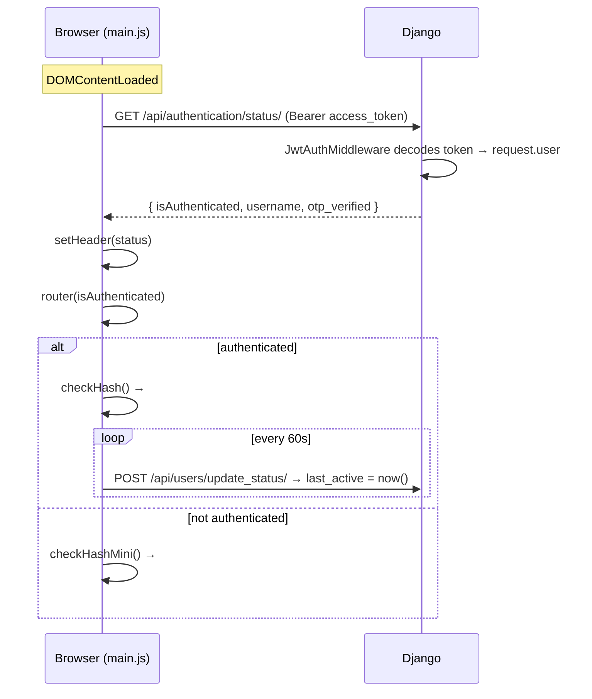
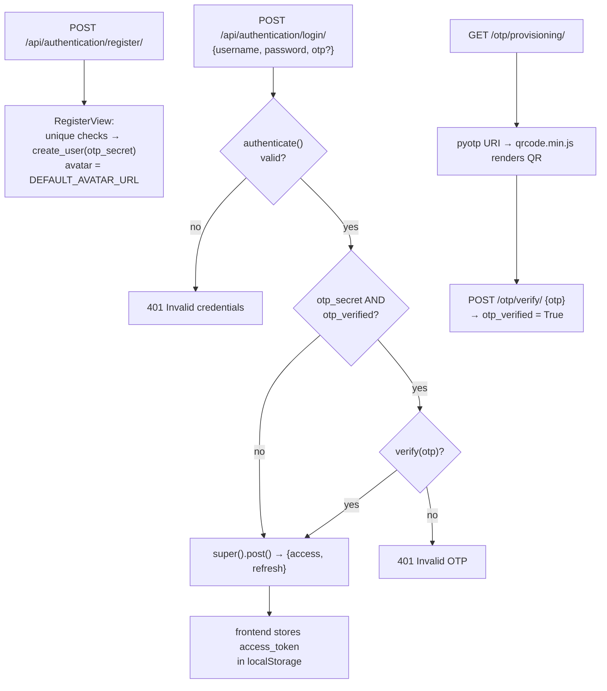
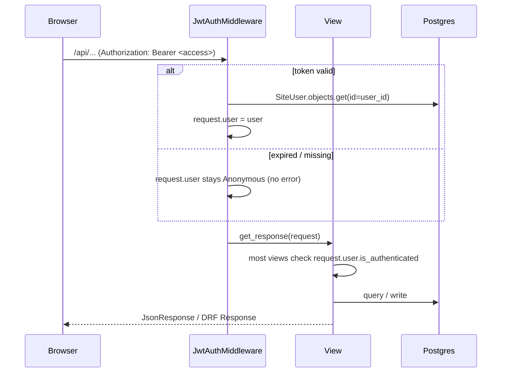
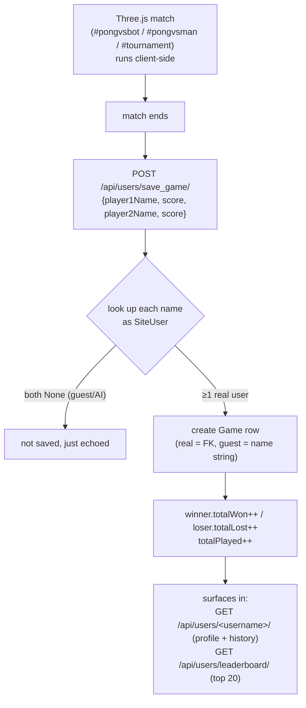

# 42-ft_transcendence

This project is centered around the design, development, and organization of a full-stack web application

## Requirement

• This project must be created in group of 3 - 5 people\
 Groupmate :
[krozis](https://github.com/krozis)
[alessiobenincasa](https://github.com/alessiobenincasa)
[42-lbastian](https://github.com/42-lbastian)

• Modules 

1.  Use a Framework as backend (Django) 
2.  Use a front-end framework or toolkit (bootstrap) 
3.  Use a database for the backend (PostgreSQL) 
4.  Standard user management, authentication, users across tournaments 
5.  Game Customization Options 
6.  Introduce an AI Opponent 
7.  User and Game Stats Dashboards
8.  Implement Two-Factor Authentication (2FA) and JWT 
9.  Use of advanced 3D techniques (Three.js) 
10. Expanding Browser Compatibility 
11. Multiple language supports

## Architecture

The app is a single-page vanilla-JS frontend (with Three.js for the Pong game) served by Nginx, talking to a Django REST backend over HTTPS, with PostgreSQL for storage. Everything runs in Docker on a single network. Authentication is JWT-based (token kept in the browser's `localStorage`) with optional TOTP two-factor.

### Request routing

### Page load / boot

### Auth flows (register / login / 2FA)

### Authenticated request (JWT middleware)

### Gameplay → persistence

## Preview

## Final Marks

