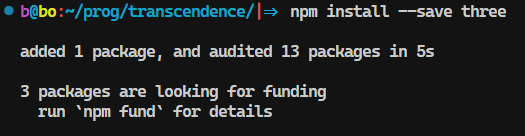
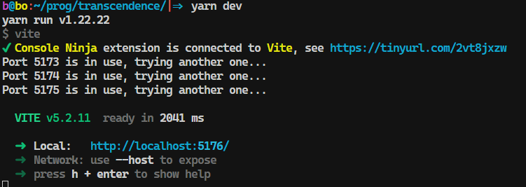
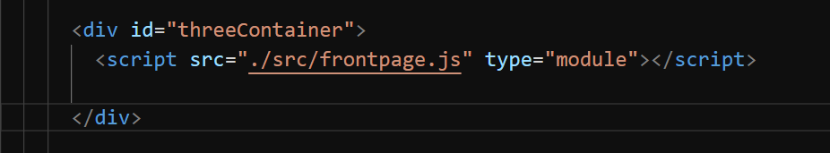
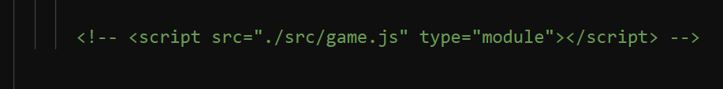
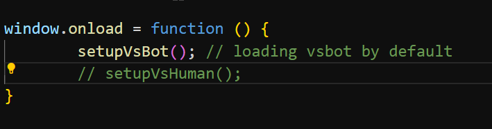

# ft_transcendence

3D PONG

1. install three.js
`npm install --save three`

2. install yarn
`yarn install`

3. Deploy
`yarn dev`

 
Remarks: - Note: 20/May -  
I - As i've mentioned in the chat, im still working on how to create button.
You can try to load the page by commenting either of one js file in the index.html

II- If you want to try vs Human mode, uncomment the setupVsHuman should work

III - Just realized cannot use vite in transcendence, i will work on deploy it without any packages.

